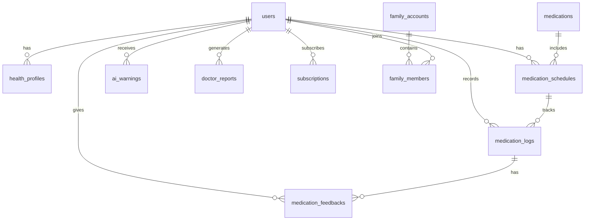

# 📝 AI用药助手 - 技术与开发日志 (Development Log)

> **项目名称**: AI用药助手  
> **开始日期**: 2026-01-17  
> **当前版本**: v0.0.1 (规划阶段)

---

## 📌 项目概览

### 项目愿景
构建一款面向老年人的用药追踪助手，通过AI技术简化用药管理流程，提高用药依从性和安全性。子女及NGO/养老院可通过家庭账户功能协助管理。

### 目标用户
| 用户类型 | 角色定位 |
|----------|----------|
| 老人 | 用户（主要使用者） |
| 子女/NGO/养老院 | 家庭账户（协助管理） |

### 核心流程约束
- 上传病例前必须完成健康档案

### 技术架构
```
┌─────────────────────────────────────────────────────────────┐
│                        前端应用层                            │
│  ┌──────────────────────────────────────────────────────┐  │
│  │                    iOS (先行)                         │  │
│  │     React (Hooks) + Capacitor Web UI                  │  │
│  │        Swift/SwiftUI (原生能力/插件)                  │  │
│  └──────────────────────────────────────────────────────┘  │
│                         ▼                                    │
│              ┌─────────────────────┐                        │
│              │  Capacitor Bridge   │                        │
│              │  (原生能力桥接)     │                        │
│              └──────────┬──────────┘                        │
└─────────────────────────┼───────────────────────────────────┘
                          ▼
┌─────────────────────────────────────────────────────────────┐
│                        服务层                                │
│  ┌─────────────┐  ┌─────────────┐  ┌─────────────┐         │
│  │  Supabase   │  │  AI服务     │  │  知识库     │         │
│  │  (后端服务)  │  │  (大模型)   │  │  (药物/期刊) │         │
│  └─────────────┘  └─────────────┘  └─────────────┘         │
│                                                              │
│  AI大模型接口（预留）：                                       │
│  • GPT (最新版本)                                            │
│  • Claude (最新版本)                                         │
│  • 国产医疗大模型                                            │
└─────────────────────────────────────────────────────────────┘
```

### 功能模块清单
| 模块编号 | 模块名称 | 优先级 | 状态 | 验收 |
|----------|----------|--------|------|------|
| M1 | 用户认证与注册 | P0 | ✅ 已完成 | ✅ |
| M2 | 健康档案管理（上传病例前必填） | P0 | ✅ 已完成 | ✅ |
| M3 | 病例识别(OCR) | P0 | ✅ 已完成 | ⬜ |
| M4 | 服药计划管理 | P0 | 🔲 待开发 | ⬜ |
| M5 | 服药追踪记录（含确认按钮） | P0 | 🔲 待开发 | ⬜ |
| M6 | 服药反馈收集 | P1 | 🔲 待开发 | ⬜ |
| M7 | AI分析与预警（含食物/饮品禁忌） | P0 | 🔲 待开发 | ⬜ |
| M8 | 医生报告生成（含处方指引） | P1 | 🔲 待开发 | ⬜ |
| M9 | 多语言支持（含全局切换按钮） | P1 | 🔲 待开发 | ⬜ |
| M10 | 家庭账户 | P2 | 🔲 待开发 | ⬜ |
| M11 | 付费功能（订阅制） | P3 | 🔲 待开发 | ⬜ |
| M12 | 隐私安全 | P0 | 🔲 待开发 | ⬜ |

**状态说明**：
- 🔲 待开发
- 🔨 开发中
- ✅ 已完成
- ⬜ 未验收
- ✅ 已验收

---

## 📅 开发日志

### 2026-01-17 (Day 1)

#### 今日工作
- [x] 项目需求分析与理解
- [x] 创建项目宪法 (`PROJECT_CONSTITUTION.md`)
- [x] 创建开发规则 (`RULES.md`)
- [x] 创建技术与开发日志 (`DEVLOG.md`)
- [x] 定义Supabase数据库表结构
- [x] 确认技术决策和待确认事项

#### 技术决策
| 决策项 | 选择 | 原因 |
|--------|------|------|
| 跨平台框架 | Capacitor | 主要业务逻辑开发 |
| 前端UI | React (Hooks) | Capacitor Web UI |
| iOS原生 | Swift/SwiftUI（仅原生能力） | iOS原生能力实现 |
| 后端服务 | Supabase | 认证+非敏感数据库+非敏感存储 |
| 国际化 | i18n | 支持简中/繁中/英文 |
| 状态管理 | 模块化Hooks | 代码质量要求 |
| 加密方案 | 本地加密存储（敏感仅本地） | 隐私安全要求 |
| 语音输入 | iOS系统原生语音识别 | ✅ 已确认 |
| AI大模型 | GPT/Claude/国产医疗大模型 | ✅ 预留接口 |
| 付费模式 | 订阅制 | ✅ 已确认 |

#### 已确认事项 ✅
| 事项 | 决策 |
|------|------|
| 语音输入 | 使用iOS系统原生语音识别 |
| AI大模型 | 预留GPT(最新版)、Claude(最新版)、国产医疗大模型接口 |
| 硬件适配 | 不预留 |
| 隐私策略 | 敏感医疗数据仅本地加密存储 |
| 付费模式 | 订阅制 |

#### 知识来源确认
| 来源类型 | 获取方式 |
|----------|----------|
| 药物说明书 | 你提供的API |
| 核心期刊论文 | 你提供的API |
| 政府指引 | 你提供的API |
| 医疗大模型 | 预留接口（由你提供API或授权接入） |

> 不使用公开抓取

#### 明日计划
- [ ] 项目初始化（Capacitor + React）
- [ ] Supabase项目创建与配置
- [ ] 基础目录结构搭建

---

## 🗄️ 数据库设计

### 数据存储策略（选项1）
- 医疗隐私数据（健康档案/用药计划/记录/反馈/预警/报告）仅本地加密存储
- Supabase仅存账号、家庭账户、订阅、非敏感配置与药物公开信息
- 用户主动分享/导出时点对点端到端加密，不在云端持久化

### 数据表结构（本地优先）

#### 1. users（用户表，云端）
```sql
CREATE TABLE users (
    id UUID PRIMARY KEY DEFAULT gen_random_uuid(),
    phone VARCHAR(20) UNIQUE,          -- 手机号
    email VARCHAR(255) UNIQUE,         -- 邮箱
    password_hash VARCHAR(255),        -- 密码哈希
    display_name VARCHAR(100),         -- 显示名称
    avatar_url TEXT,                   -- 头像URL
    language VARCHAR(10) DEFAULT 'zh-CN', -- 语言偏好
    created_at TIMESTAMPTZ DEFAULT NOW(),
    updated_at TIMESTAMPTZ DEFAULT NOW(),
    last_login_at TIMESTAMPTZ
);

-- 说明：用户基本认证信息
-- 隐私级别：中
```

#### 2. health_profiles（健康档案表，本地）
```sql
CREATE TABLE health_profiles (
    id UUID PRIMARY KEY DEFAULT gen_random_uuid(),
    user_id UUID REFERENCES users(id) ON DELETE CASCADE,
    
    -- 基本信息
    birth_date DATE,                   -- 出生日期
    gender VARCHAR(10),                -- 性别
    height_cm DECIMAL(5,2),            -- 身高(cm)
    weight_kg DECIMAL(5,2),            -- 体重(kg)
    
    -- 健康信息（加密存储）
    medical_history_encrypted TEXT,    -- 过往病史(加密)
    allergies_encrypted TEXT,          -- 过敏药物(加密)
    
    created_at TIMESTAMPTZ DEFAULT NOW(),
    updated_at TIMESTAMPTZ DEFAULT NOW(),
    
    UNIQUE(user_id)
);

-- 说明：用户健康档案，敏感信息加密存储
-- 隐私级别：高，本地加密存储
```

#### 3. medications（药物信息表，云端）
```sql
CREATE TABLE medications (
    id UUID PRIMARY KEY DEFAULT gen_random_uuid(),
    
    -- 药物基本信息
    name_zh VARCHAR(255),              -- 中文名
    name_en VARCHAR(255),              -- 英文名
    name_generic VARCHAR(255),         -- 通用名
    manufacturer VARCHAR(255),         -- 生产厂家
    
    -- 药物说明
    dosage_form VARCHAR(50),           -- 剂型（片剂/胶囊/液体等）
    specification VARCHAR(100),        -- 规格
    instructions TEXT,                 -- 服用说明
    contraindications TEXT,            -- 禁忌症
    side_effects TEXT,                 -- 副作用
    
    -- 处方指引（新增）
    efficacy_check_days INTEGER,       -- 疗效检查天数（如7天未见效需咨询医生）
    
    -- 元数据
    barcode VARCHAR(50),               -- 条形码
    image_url TEXT,                    -- 药物图片
    
    created_at TIMESTAMPTZ DEFAULT NOW(),
    updated_at TIMESTAMPTZ DEFAULT NOW()
);

-- 说明：药物信息库，可从外部API同步
-- 隐私级别：低（公开信息）
```

#### 4. medication_schedules（服药计划表，本地）
```sql
CREATE TABLE medication_schedules (
    id UUID PRIMARY KEY DEFAULT gen_random_uuid(),
    user_id UUID REFERENCES users(id) ON DELETE CASCADE,
    medication_id UUID REFERENCES medications(id),
    
    -- 服药计划
    dosage VARCHAR(50),                -- 单次剂量
    frequency VARCHAR(50),             -- 服用频率（每日1次/每日2次等）
    times_per_day INTEGER,             -- 每天几次
    specific_times TIME[],             -- 具体服药时间
    
    -- 周期
    start_date DATE NOT NULL,          -- 开始日期
    end_date DATE,                     -- 结束日期（空表示长期）
    total_days INTEGER,                -- 总天数
    
    -- 处方指引（新增）
    prescription_notes TEXT,           -- 医嘱备注
    efficacy_check_date DATE,          -- 疗效检查日期
    
    -- 来源
    source_type VARCHAR(20),           -- 来源类型（医嘱/自添加）
    source_image_url TEXT,             -- 来源图片（病例照片）
    
    -- 状态
    status VARCHAR(20) DEFAULT 'active', -- 状态（active/paused/completed）
    
    created_at TIMESTAMPTZ DEFAULT NOW(),
    updated_at TIMESTAMPTZ DEFAULT NOW()
);

-- 说明：用户的服药计划
-- 隐私级别：高
```

#### 5. medication_logs（服药记录表，本地）
```sql
CREATE TABLE medication_logs (
    id UUID PRIMARY KEY DEFAULT gen_random_uuid(),
    schedule_id UUID REFERENCES medication_schedules(id) ON DELETE CASCADE,
    user_id UUID REFERENCES users(id) ON DELETE CASCADE,
    
    -- 记录信息
    scheduled_time TIMESTAMPTZ,        -- 计划服药时间
    actual_time TIMESTAMPTZ,           -- 实际服药时间
    status VARCHAR(20),                -- 状态（taken/skipped/delayed）
    
    -- 确认方式（新增）
    confirmed_by VARCHAR(20),          -- 确认方式（button/voice/auto）
    
    -- 服药数量（如果与计划不同）
    actual_dosage VARCHAR(50),
    
    created_at TIMESTAMPTZ DEFAULT NOW()
);

-- 说明：每次服药的记录，支持一键确认按钮
-- 隐私级别：高
```

#### 6. medication_feedbacks（服药反馈表，本地）
```sql
CREATE TABLE medication_feedbacks (
    id UUID PRIMARY KEY DEFAULT gen_random_uuid(),
    log_id UUID REFERENCES medication_logs(id) ON DELETE CASCADE,
    user_id UUID REFERENCES users(id) ON DELETE CASCADE,
    
    -- 反馈内容
    feedback_text TEXT,                -- 文字反馈
    feedback_audio_url TEXT,           -- 语音反馈URL（iOS原生语音识别）
    
    -- AI分析结果
    sentiment VARCHAR(20),             -- 情感分析结果
    keywords TEXT[],                   -- 关键词提取
    
    created_at TIMESTAMPTZ DEFAULT NOW()
);

-- 说明：用户服药后的主观反馈
-- 隐私级别：高
```

#### 7. ai_warnings（AI预警记录表，本地）
```sql
CREATE TABLE ai_warnings (
    id UUID PRIMARY KEY DEFAULT gen_random_uuid(),
    user_id UUID REFERENCES users(id) ON DELETE CASCADE,
    
    -- 预警信息
    warning_type VARCHAR(50),          -- 预警类型（冲突/过量/禁忌/食物饮品禁忌/疗效检查）
    severity VARCHAR(20),              -- 严重程度（low/medium/high/critical）
    title VARCHAR(255),                -- 预警标题
    description TEXT,                  -- 详细描述
    
    -- 关联药物
    medication_ids UUID[],             -- 关联的药物ID
    
    -- 知识来源
    source_type VARCHAR(50),           -- 来源类型（说明书/期刊/政府指引/大模型）
    source_reference TEXT,             -- 来源引用
    
    -- 状态
    is_read BOOLEAN DEFAULT FALSE,
    is_dismissed BOOLEAN DEFAULT FALSE,
    
    created_at TIMESTAMPTZ DEFAULT NOW()
);

-- 说明：AI生成的用药预警
-- 隐私级别：中
```

#### 8. doctor_reports（医生报告表，本地）
```sql
CREATE TABLE doctor_reports (
    id UUID PRIMARY KEY DEFAULT gen_random_uuid(),
    user_id UUID REFERENCES users(id) ON DELETE CASCADE,
    
    -- 报告内容
    report_period_start DATE,          -- 报告周期开始
    report_period_end DATE,            -- 报告周期结束
    summary_text TEXT,                 -- AI生成的摘要
    
    -- 处方指引相关（新增）
    prescription_guidance TEXT,        -- 处方指引（如7天后未见效需停止服药）
    efficacy_assessment TEXT,          -- 疗效评估
    
    -- 统计数据
    compliance_rate DECIMAL(5,2),      -- 服药依从率
    total_medications INTEGER,         -- 药物种类数
    total_doses INTEGER,               -- 总服药次数
    
    -- 导出信息
    export_format VARCHAR(20),         -- 导出格式
    export_url TEXT,                   -- 导出文件URL
    
    created_at TIMESTAMPTZ DEFAULT NOW()
);

-- 说明：为医生生成的阶段性报告，包含处方指引
-- 隐私级别：高
```

#### 9. family_accounts（家庭账户表，云端）
```sql
CREATE TABLE family_accounts (
    id UUID PRIMARY KEY DEFAULT gen_random_uuid(),
    name VARCHAR(100),                 -- 家庭组名称
    owner_id UUID REFERENCES users(id) ON DELETE CASCADE,
    created_at TIMESTAMPTZ DEFAULT NOW()
);

CREATE TABLE family_members (
    id UUID PRIMARY KEY DEFAULT gen_random_uuid(),
    family_id UUID REFERENCES family_accounts(id) ON DELETE CASCADE,
    user_id UUID REFERENCES users(id) ON DELETE CASCADE,
    role VARCHAR(20),                  -- 角色（owner/admin/member）
    member_type VARCHAR(20),           -- 成员类型（elder/child/ngo/care_home）
    nickname VARCHAR(100),             -- 家庭内昵称
    permissions JSONB,                 -- 权限配置
    joined_at TIMESTAMPTZ DEFAULT NOW(),
    
    UNIQUE(family_id, user_id)
);

-- 说明：家庭账户关联，支持子女/NGO/养老院管理
-- 隐私级别：中
```

#### 10. subscriptions（订阅表，云端）
```sql
CREATE TABLE subscriptions (
    id UUID PRIMARY KEY DEFAULT gen_random_uuid(),
    user_id UUID REFERENCES users(id) ON DELETE CASCADE,
    
    -- 订阅信息（订阅制）
    plan_type VARCHAR(50),             -- 计划类型（free/basic/premium）
    billing_cycle VARCHAR(20),         -- 计费周期（monthly/yearly）
    status VARCHAR(20),                -- 状态（active/cancelled/expired）
    
    -- 时间
    started_at TIMESTAMPTZ,
    expires_at TIMESTAMPTZ,
    cancelled_at TIMESTAMPTZ,
    next_billing_date TIMESTAMPTZ,     -- 下次扣费日期
    
    -- 支付信息
    payment_provider VARCHAR(50),      -- 支付渠道（apple_pay等）
    payment_reference VARCHAR(255),    -- 支付参考号
    
    created_at TIMESTAMPTZ DEFAULT NOW(),
    updated_at TIMESTAMPTZ DEFAULT NOW()
);

-- 说明：用户订阅记录（订阅制付费模式）
-- 隐私级别：中
```

### 数据库关系图
> 关系图为逻辑模型，存储位置按上方标注执行


---

## 🔧 技术栈详情

### 前端技术栈
| 技术 | 版本 | 用途 |
|------|------|------|
| React | 最新 | Web UI（Capacitor） |
| TypeScript | 最新 | 类型系统 |
| Capacitor | 5.x | 跨平台主要业务逻辑 |
| i18next | 23.x | 国际化 |

### iOS原生功能
| 功能 | 实现方式 |
|------|----------|
| 原生能力/插件 | Swift/SwiftUI |
| 语音识别 | iOS原生Speech框架 |
| 相机/相册 | iOS原生AVFoundation |
| 本地存储加密 | iOS Keychain |
| 推送通知 | APNs |

### 后端服务
| 服务 | 用途 |
|------|------|
| Supabase Auth | 用户认证 |
| Supabase Database | 非敏感数据存储 |
| Supabase Storage | 非敏感文件（不含医疗隐私） |
| Supabase Edge Functions | 服务端逻辑 |

### AI/ML服务（预留接口）
| 服务 | 用途 | 状态 |
|------|------|------|
| OCR服务 | 病例/药盒识别 | 待接入 |
| GPT (最新版) | 智能分析与对话 | 预留接口 |
| Claude (最新版) | 智能分析与对话 | 预留接口 |
| 国产医疗大模型 | 医疗专业分析 | 预留接口 |

### 知识库来源
| 来源 | 获取方式 |
|------|----------|
| 药物说明书 | 你提供的API |
| 核心期刊论文 | 你提供的API |
| 政府指引 | 你提供的API |

> 不使用公开抓取

---

## 📊 里程碑计划

### Phase 1: 基础框架 (Week 1-2)
- [ ] 项目初始化（Capacitor + React）
- [ ] Supabase配置
- [ ] 用户认证模块
- [ ] 基础UI组件库（老年友好设计）

### Phase 2: 核心功能 (Week 3-6)
- [ ] 健康档案
- [ ] 病例识别(OCR)
- [ ] 服药计划管理
- [ ] 服药追踪（一键确认按钮）

### Phase 3: AI功能 (Week 7-8)
- [ ] AI分析引擎
- [ ] 预警系统
- [ ] 医生报告（含处方指引）

### Phase 4: 增强功能 (Week 9-10)
- [ ] 多语言
- [ ] 家庭账户
- [ ] 付费功能（订阅制）

### Phase 5: 测试与发布 (Week 11-12)
- [ ] 集成测试
- [ ] iOS模拟器验收测试
- [ ] App Store提交

---

## ✅ DOD验收要求（重要）

每个模块必须满足以下条件才能进入下一模块：

1. **代码层面**
   - [ ] 代码成功编译，无错误
   - [ ] 所有单元测试通过
   - [ ] 代码符合模块化Hooks规范
   - [ ] 注释完整且可读
   - [ ] **需要在iOS模拟器中跑通**

2. **功能层面**
   - [ ] 功能在iOS模拟器/真机正常运行
   - [ ] 核心用户流程可完整走通

3. **测试要求**
   - [ ] 核心业务逻辑覆盖率 ≥ 90%
   - [ ] 每个Hook必须有对应测试文件

---

## 📎 附录

### 参考资源
- [Capacitor 官方文档](https://capacitorjs.com/docs)
- [Supabase 官方文档](https://supabase.com/docs)
- [i18next 官方文档](https://www.i18next.com/)
- [SwiftUI 官方文档](https://developer.apple.com/xcode/swiftui/)

### 相关开源项目
- Ada Health（健康档案参考）
- 待调研更多医疗相关开源项目

---

**日志维护人**: 开发团队  
**下次更新**: 待定
